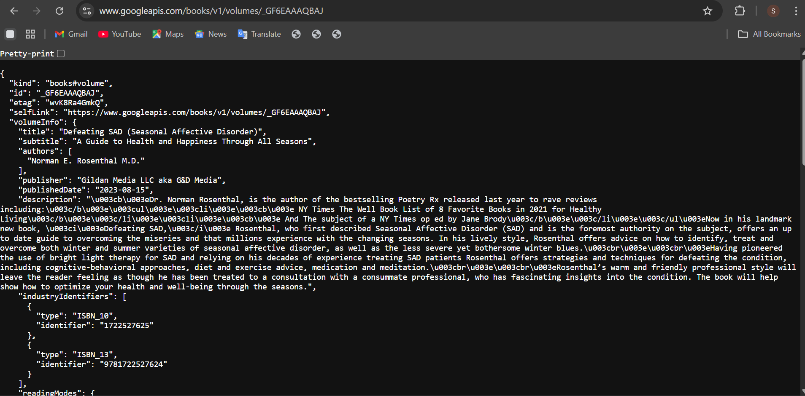
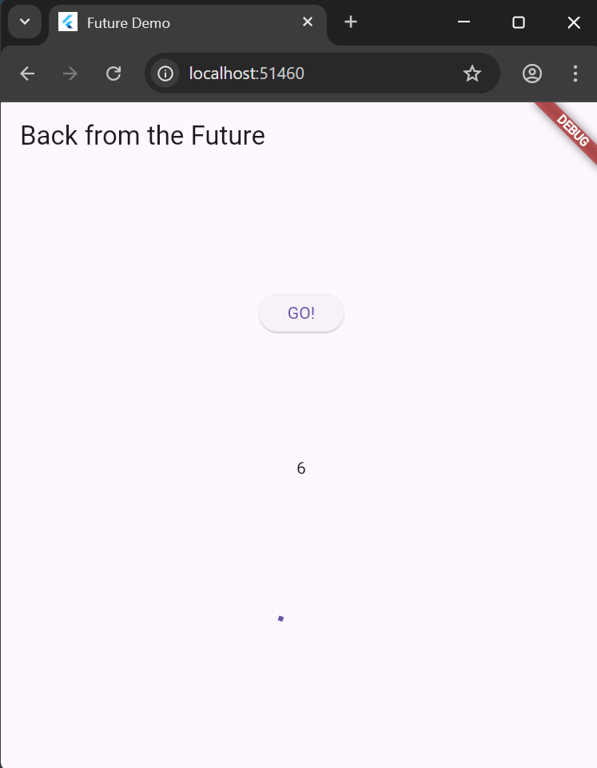
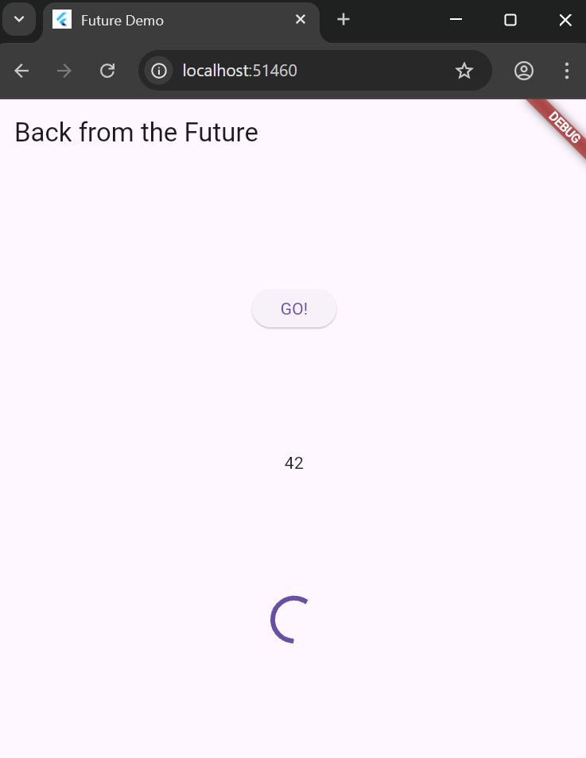
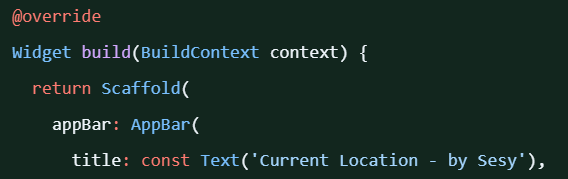
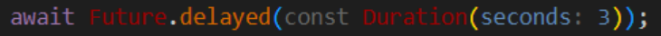
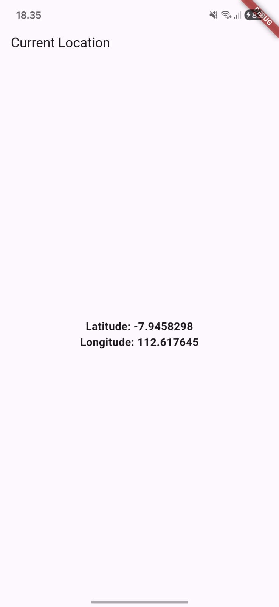
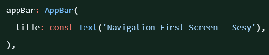
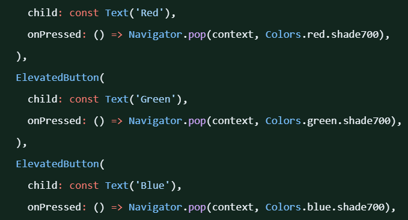
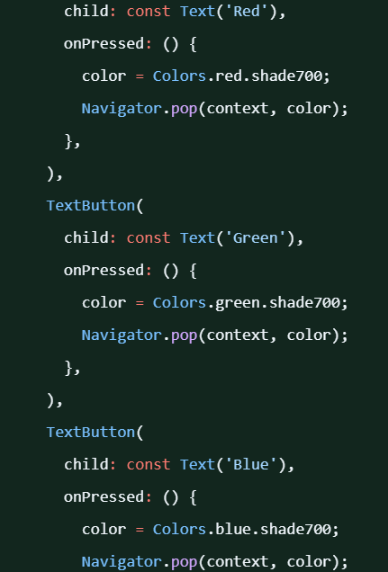

# Pemrograman Mobile - Pertemuan 11

### NAMA: Sesy Tana Lina Rahmatin
### KELAS: TI-3F
### NIM: 2341720029

# soal 1
Tambahkan nama panggilan Anda pada title app sebagai identitas hasil pekerjaan Anda.

# soal 2
Carilah judul buku favorit Anda di Google Books, lalu ganti ID buku pada variabel path di kode tersebut. Caranya ambil di URL browser Anda seperti gambar berikut ini.

# soal 3
Jelaskan maksud kode langkah 5 tersebut terkait substring dan catchError!
- Bagian substring(0, 450) digunakan untuk menampilkan hanya 450 karakter pertama dari hasil respons HTTP agar tampilannya lebih ringkas dan mudah dibaca. Sementara itu, catchError berfungsi menangani kesalahan saat mengambil data dari internet, seperti koneksi gagal atau server tidak merespons, lalu menampilkan pesan error melalui setState().

- Capture hasil praktikum Anda berupa GIF dan lampirkan di README. Lalu lakukan commit dengan pesan "W11: Soal 3".
https://github.com/user-attachments/assets/fadfd5ca-dd6a-4ddf-af77-938b4d847dfd

# Soal 4
- Jelaskan maksud kode langkah 1 dan 2 tersebut!
  
    Jawab:  
Pada tahap pertama, terdapat tiga method asynchronous yaitu returnOneAsync, returnTwoAsync, dan returnThreeAsync yang digunakan untuk meniru proses yang memerlukan waktu tertentu, misalnya pengambilan data dari internet. Setiap method menggunakan Future.delayed selama tiga detik sebelum mengembalikan nilai masing-masing 1, 2, dan 3. Sementara itu, pada tahap kedua, method count() berperan untuk menjalankan ketiga method tersebut secara berurutan dengan await, sehingga setiap proses akan ditunggu hingga selesai sebelum melanjutkan ke proses berikutnya. Nilai yang diperoleh dari ketiga pemanggilan tersebut dijumlahkan, lalu ditampilkan ke antarmuka aplikasi menggunakan setState() agar variabel result diperbarui dan hasilnya tampak di layar.

- Capture hasil praktikum Anda berupa GIF dan lampirkan di README. Lalu lakukan commit dengan pesan "W11: Soal 4".

# Soal 5
- Jelaskan maksud kode langkah 2 tersebut!

    Jawab :
  Pada tahap kedua ini, kode memanfaatkan Completer untuk mengatur jalannya proses asynchronous secara manual. Variabel late Completer completer; berfungsi sebagai penampung yang nantinya akan digunakan untuk menyelesaikan proses asynchronous dan mengirimkan hasilnya. Method getNumber() bertugas membuat objek Completer<int>() baru, lalu memanggil method calculate() yang menjalankan proses asynchronous selama 5 detik menggunakan Future.delayed. Setelah waktu tunggu berakhir, calculate() memanggil completer.complete(42); sebagai tanda bahwa proses asynchronous sudah selesai dan menghasilkan nilai 42. Nilai tersebut dapat diakses melalui completer.future, yang dikembalikan oleh getNumber(). Secara sederhana, kode ini meniru proses yang berjalan di latar belakang selama 5 detik sebelum mengembalikan data berupa angka 42 yang bisa dimanfaatkan oleh bagian lain dari aplikasi.

- Capture hasil praktikum Anda berupa GIF dan lampirkan di README. Lalu lakukan commit dengan pesan "W11: Soal 5".

# soal 6
- Jelaskan maksud perbedaan kode langkah 2 dengan langkah 5-6 tersebut!

    Jawab:
    Perbedaan utama antara langkah 2 dan langkah 5–6 terletak pada cara pengelolaan hasil dan penanganan kesalahan dalam proses asynchronous. Pada langkah 2, kode hanya memanfaatkan Completer untuk menjalankan proses sederhana yang selalu berhasil setelah penundaan selama lima detik dan menghasilkan nilai 42, tanpa adanya mekanisme penanganan error. Sementara itu, pada langkah 5–6, method calculate() telah ditingkatkan dengan menambahkan blok try–catch untuk mengantisipasi kemungkinan terjadinya kesalahan. Jika proses berjalan lancar, maka completer.complete(42) akan dipanggil, sedangkan jika terjadi error, eksekusi akan dialihkan ke completer.completeError(). Selain itu, bagian onPressed() juga diperbarui dengan penggunaan .then() untuk menampilkan hasil yang berhasil ke antarmuka pengguna dan .catchError() untuk menampilkan pesan kesalahan. Dengan demikian, proses asynchronous menjadi lebih tangguh dan interaktif dalam menangani berbagai situasi.

- Capture hasil praktikum Anda berupa GIF dan lampirkan di README. Lalu lakukan commit dengan pesan "W11: Soal 6".

# Soal 7
Capture hasil praktikum Anda berupa GIF dan lampirkan di README. Lalu lakukan commit dengan pesan "W11: Soal 7"
https://github.com/user-attachments/assets/2c2d65f9-e767-4a9d-b38a-70940c09a752

# Soal 8
Jelaskan maksud perbedaan kode langkah 1 dan 4!

Jawab: 
Perbedaan antara langkah 1 dan langkah 4 terletak pada metode yang digunakan untuk menjalankan beberapa proses asynchronous secara paralel. Pada langkah 1, digunakan FutureGroup dari pustaka eksternal untuk menggabungkan beberapa Future dan menunggu semuanya selesai terlebih dahulu. Sementara pada langkah 4, digunakan Future.wait(), yaitu fitur bawaan dari Dart yang memiliki fungsi serupa namun lebih praktis dan ringan karena tidak memerlukan pembentukan grup secara manual. Dengan kata lain, Future.wait() menawarkan cara yang lebih sederhana untuk menunggu sejumlah proses asynchronous selesai bersamaan.

# Soal 9
Capture hasil praktikum Anda berupa GIF dan lampirkan di README. Lalu lakukan commit dengan pesan "W11: Soal 9".
https://github.com/user-attachments/assets/4255b16e-366d-4065-b997-7fc0e326c0f4

# Soal 10
Panggil method handleError() tersebut di ElevatedButton, lalu run. Apa hasilnya? Jelaskan perbedaan kode langkah 1 dan 4!

Jawab :
Ketika method handleError() dijalankan melalui tombol ElevatedButton, tampilan di UI akan menampilkan pesan "Exception: Something terrible happened!", sedangkan di konsol muncul teks "Complete". Pesan kesalahan tersebut berasal dari method returnError(), yang secara sengaja melempar exception setelah penundaan selama dua detik. Perbedaannya, pada langkah 1, error hanya dilempar tanpa mekanisme penanganan, sehingga berpotensi membuat aplikasi berhenti. Namun, pada langkah 4, error tersebut sudah diantisipasi menggunakan blok try–catch, sehingga program tetap dapat berjalan dengan normal. Selain itu, bagian finally memastikan bahwa pesan "Complete" tetap ditampilkan, baik proses berhasil maupun terjadi error.
https://github.com/user-attachments/assets/4255b16e-366d-4065-b997-7fc0e326c0f4
  
# Soal 11
Tambahkan nama panggilan Anda pada tiap properti title sebagai identitas pekerjaan Anda.

# Soal 12
- Jika Anda tidak melihat animasi loading tampil, kemungkinan itu berjalan sangat cepat. Tambahkan delay pada method getPosition() dengan kode await Future.delayed(const Duration(seconds: 3));

    Jawab :

- Apakah Anda mendapatkan koordinat GPS ketika run di browser? Mengapa demikian?

    Jawab :
    Tidak, saat dijalankan di browser, aplikasi umumnya tidak bisa memperoleh koordinat GPS yang benar-benar akurat. Ini disebabkan karena Flutter Web tidak memiliki akses langsung ke sensor GPS perangkat. Sebagai gantinya, aplikasi hanya memanfaatkan API geolokasi milik browser, yang menentukan lokasi berdasarkan Wi-Fi, alamat IP, atau lokasi umum perangkat desktop. Selain itu, browser dapat membatasi akses lokasi jika aplikasi tidak dijalankan melalui HTTPS atau jika pengguna menolak memberikan izin lokasi. Akibatnya, aplikasi mungkin menampilkan error atau hanya menunjukkan perkiraan posisi, bukan data GPS yang sebenarnya.

- Capture hasil praktikum Anda berupa GIF dan lampirkan di README. Lalu lakukan commit dengan pesan "W11: Soal 12".

# Soal 13
- Apakah ada perbedaan UI dengan praktikum sebelumnya? Mengapa demikian?

    Jawab :
Benar, ada perbedaan tampilan antarmuka antara praktikum sebelumnya dan praktikum kali ini. Pada praktikum sebelumnya, pengambilan data lokasi dilakukan menggunakan then() dan pembaruan tampilannya dilakukan secara manual lewat setState(). Sementara itu, pada praktikum kali ini digunakan FutureBuilder, yang membuat tampilan lebih dinamis, rapi, dan responsif terhadap perubahan data. Dengan FutureBuilder, proses pemanggilan data dikelola otomatis melalui status Future, sehingga UI dapat menampilkan indikator loading saat data masih diproses dan menampilkan hasil lokasi setelah selesai. Pendekatan ini membuat kode lebih sederhana serta membantu memisahkan logika asynchronous dari tampilan UI dengan cara yang lebih terstruktur.

- Capture hasil praktikum Anda berupa GIF dan lampirkan di README. Lalu lakukan commit dengan pesan "W11: Soal 13".

 https://github.com/user-attachments/assets/91bd4f42-c08d-40c2-87f4-07c213a75d5d

- Seperti yang terlihat, penggunaan FutureBuilder membuat tampilan menjadi lebih efisien, rapi, dan responsif karena mampu mengintegrasikan Future dengan UI secara otomatis.

# Soal 14
- Apakah ada perbedaan UI dengan langkah sebelumnya? Mengapa demikian?

    Jawab :
Secara tampilan, tidak ada perubahan yang terlihat dibandingkan langkah sebelumnya selama proses mendapatkan lokasi berjalan lancar. Penambahan pengecekan snapshot.hasError hanya berfungsi sebagai mekanisme penanganan saat terjadi error. Jadi, jika lokasi berhasil diambil tanpa kendala, UI tetap menampilkan koordinat seperti biasa. Namun ketika terjadi masalah — misalnya pengguna menolak izin lokasi atau GPS dimatikan — maka aplikasi akan menampilkan pesan "Something terrible happened!". Dengan begitu, kini aplikasi memiliki respons yang jelas ketika terjadi kegagalan dalam proses pengambilan lokasi.

- Capture hasil praktikum Anda berupa GIF dan lampirkan di README. Lalu lakukan commit dengan pesan "W11: Soal 14".
  
 https://github.com/user-attachments/assets/91bd4f42-c08d-40c2-87f4-07c213a75d5d

 # Soal 15
 - Tambahkan nama panggilan Anda pada tiap properti title sebagai identitas pekerjaan Anda.

# Soal 16
- Cobalah klik se tiap button, apa yang terjadi ? Mengapa demikian ?

    Jawab :
Saat salah satu tombol ditekan, halaman kedua akan mengirimkan warna yang dipilih (seperti merah, hijau, atau biru) kembali ke halaman pertama melalui Navigator.pop(). Nilai warna tersebut kemudian diterima oleh halaman pertama menggunakan await Navigator.push(), dan setState() dipanggil untuk memperbarui warna latar belakang. Akibatnya, background pada halaman pertama langsung berubah sesuai warna tombol yang dipilih. Proses ini bekerja karena Navigator di Flutter memungkinkan pengiriman data antarscreen secara dinamis tanpa harus menjalankan ulang aplikasi.

    https://github.com/user-attachments/assets/913f031f-1522-4e06-b154-359f6b2a31fb

- Gantilah 3 warna pada langkah 5 dengan warna favorit Anda!

- Capture hasil praktikum Anda berupa GIF dan lampirkan di README. Lalu lakukan commit dengan pesan "W11: Soal 16".
https://github.com/user-attachments/assets/913f031f-1522-4e06-b154-359f6b2a31fb

# Soal 17
- Cobalah klik setiap button, apa yang terjadi ? Mengapa demikian ?
  
    Jawab:
    Ketika tombol "Change Color" ditekan, fungsi _showColorDialog akan dijalankan, lalu memunculkan AlertDialog melalui await showDialog. Karena menggunakan await, proses dalam fungsi tersebut berhenti sejenak sampai dialog ditutup. Saat salah satu warna (Pink, Kuning, atau Tosca) dipilih, aksi onPressed pada tombol akan mengubah nilai variabel color dan memanggil Navigator.pop(context) untuk menutup dialog. Setelah dialog tertutup, proses await selesai dan eksekusi kode berlanjut ke setState(() {}), yang memicu Flutter untuk melakukan rebuild UI. Hasilnya, backgroundColor pada Scaffold langsung diperbarui sesuai warna yang dipilih oleh pengguna.
    https://github.com/user-attachments/assets/3ff92fb7-4c70-4967-8ee8-651af0861248

- Gantilah 3 warna pada langkah 3 dengan warna favorit Anda!
  

- Capture hasil praktikum Anda berupa GIF dan lampirkan di README. Lalu lakukan commit dengan pesan "W11: Soal 17".

https://github.com/user-attachments/assets/3ff92fb7-4c70-4967-8ee8-651af0861248
  

  