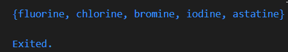
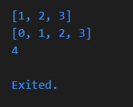

# Pemrograman Mobile - Pertemuan 4

NAMA: Sesy Tana Lina Rahmatin
KELAS: TI-3F
NIM: 2341720029

1.Silakan selesaikan Praktikum 1 sampai 5, lalu dokumentasikan berupa screenshot hasil pekerjaan Anda beserta penjelasannya!

# Praktikum 1: Eksperimen Tipe Data List

Langkah 1
Ketik atau salin kode program berikut ke dalam void main().

```
var list = [1, 2, 3];
assert(list.length == 3);
assert(list[1] == 2);
print(list.length);
print(list[1]);

list[1] = 1;
assert(list[1] == 1);
print(list[1]);
```

Langkah 2
Silakan coba eksekusi (Run) kode pada langkah 1 tersebut. Apa yang terjadi? Jelaskan!
Penjelasan:
Kode tersebut akan menghasilkan output yang sesuai saat dijalankan karena menggunakan fungsi assert() untuk memverifikasi kondisi tertentu. Jika kondisi tersebut tidak terpenuhi, maka assert() akan memicu error sehingga eksekusi program dihentikan.
Output:


Langkah 3
Ubah kode pada langkah 1 menjadi variabel final yang mempunyai index = 5 dengan default value = null. Isilah nama dan NIM Anda pada elemen index ke-1 dan ke-2. Lalu print dan capture hasilnya.
Apa yang terjadi ? Jika terjadi error, silakan perbaiki.
```
final List list = List<String?>.filled(5, null);
  list[1] = 'Sesy Tana Lina Rahmatin';
  list[2] = '2341720029';

  print('Length list: ${list.length}');
  print('Element index 1: ${list[1]}');
  print('Element index 2: ${list[2]}');
  print('List: $list');
```

Penjelasan:
- final digunakan supaya referensi list tidak dapat diganti ke objek lain.
- List<String?> berarti list tersebut bisa menyimpan elemen bertipe String yang nilainya boleh null.
- List.filled(5, null) artinya membuat list berukuran 5 elemen, dan setiap elemennya diisi nilai awal null.

Output:


# Praktikum 2: Eksperimen Tipe Data Set

Langkah 1
Ketik atau salin kode program berikut ke dalam fungsi main().
var halogens = {'fluorine', 'chlorine', 'bromine', 'iodine', 'astatine'};
print(halogens);

Langkah 2
Silakan coba eksekusi (Run) kode pada langkah 1 tersebut. Apa yang terjadi? Jelaskan! Lalu perbaiki jika terjadi error.

Penjelasan:
- Variabel halogens dibuat dengan tipe data Set.
- Isi dari halogens kemudian ditampilkan.

Output:


Langkah 3
Tambahkan kode program berikut, lalu coba eksekusi (Run) kode Anda.
```
var names1 = <String>{};
Set<String> names2 = {}; // This works, too.
var names3 = {}; // Creates a map, not a set.

print(names1);
print(names2);
print(names3);
```

Apa yang terjadi ? Jika terjadi error, silakan perbaiki namun tetap menggunakan ketiga variabel tersebut. Tambahkan elemen nama dan NIM Anda pada kedua variabel Set tersebut dengan dua fungsi berbeda yaitu .add() dan .addAll(). Untuk variabel Map dihapus, nanti kita coba di praktikum selanjutnya.

Penjelasan: Mendeklarasi tiga variabel:
- var names1 = <String>{}; mendefinisikan sebuah Set kosong dengan tipe String secara jelas.
- Set<String> names2 = {}; membuat Set kosong bertipe String dengan penulisan tipe data di depan.
- var names3 = {}; bukan Set, melainkan Map kosong karena tidak ada penentuan tipe.

Output:


Kode setelah ditambahkan:
```
void main() {
  var halogens = {'fluorine', 'chlorine', 'bromine', 'iodine', 'astatine'};
  print(halogens);

  var names1 = <String>{};
  Set<String> names2 = {}; // This works, too.
  var names3 = <String>{}; // Creates a map, not a set.

  // .add()
  names2.add('Sesy Tana Lina Rahmatin');
  names2.add('2341720029');

  // .addAll()
  names3.addAll(['Sesy Tana Lina Rahmatin', '2341720029']);

  print("names1 : $names1");
  print("names2 .add(): $names2");
  print("names3 .addAll(): $names3");
}
```
output:


# Praktikum 3: Eksperimen Tipe Data Maps

Langkah 1:
Ketik atau salin kode program berikut ke dalam fungsi main().
```
var gifts = {
  // Key:    Value
  'first': 'partridge',
  'second': 'turtledoves',
  'fifth': 1
};

var nobleGases = {
  2: 'helium',
  10: 'neon',
  18: 2,
};

print(gifts);
print(nobleGases);
```

Langkah 2:
Silakan coba eksekusi (Run) kode pada langkah 1 tersebut. Apa yang terjadi? Jelaskan! Lalu perbaiki jika terjadi error. Menampilkan value dari gifts dan nobleGases

Output:


Langkah 3:
Tambahkan kode program berikut, lalu coba eksekusi (Run) kode Anda.
```
var mhs1 = Map<String, String>();
gifts['first'] = 'partridge';
gifts['second'] = 'turtledoves';
gifts['fifth'] = 'golden rings';

var mhs2 = Map<int, String>();
nobleGases[2] = 'helium';
nobleGases[10] = 'neon';
nobleGases[18] = 'argon';
```

Apa yang terjadi ? Jika terjadi error, silakan perbaiki.
Tambahkan elemen nama dan NIM Anda pada tiap variabel di atas (gifts, nobleGases, mhs1, dan mhs2). Dokumentasikan hasilnya dan buat laporannya!

Penambahan code dengan Nama dan Nim:
```
var mhs1 = Map<String, String>();
  mhs1['nama'] = 'Sesy Tana Lina Rahmatin';
  mhs1['nim'] = '2341720029';

  gifts['first'] = 'partridge';
  gifts['second'] = 'turtledoves';
  gifts['fifth'] = 'golden rings';
  gifts['nama'] = 'Sesy Tana Lina Rahmatin';
  gifts['nim'] = '2341720029';

  var mhs2 = Map<int, String>();
  mhs2[0] = 'Sesy Tana Lina Rahmatin';
  mhs2[1] = '2341720029';

  nobleGases[2] = 'helium';
  nobleGases[10] = 'neon';
  nobleGases[18] = 'argon';
  nobleGases[0] = 'Sesy Tana Lina Rahmatin';
  nobleGases[1] = '2341720029';

  print('\n=== HASIL ===');
  print('gifts: $gifts');
  print('nobleGases: $nobleGases');
  print('mhs1: $mhs1');
  print('mhs2: $mhs2');
```
Penjelasan:
Menambahkan dan menampilkan value dari variable gifts, nobleGases, mhs1, dan mhs2

Output:


# Praktikum 4: Eksperimen Tipe Data List: Spread dan Control-flow Operators

Langkah 1
Ketik atau salin kode program berikut ke dalam fungsi main().
```
var list = [1, 2, 3];
var list2 = [0, ...list];
print(list1);
print(list2);
print(list2.length);
```

Langkah 2
Silakan coba eksekusi (Run) kode pada langkah 1 tersebut. Apa yang terjadi? Jelaskan! Lalu perbaiki jika terjadi error.

Terjadi error karena variable list1 tidak ada, diperbaiki dengan mengubah variable list1 menjadi list saat print(), sehingga
```
var list = [1, 2, 3];
var list2 = [0, ...list];
print(list);
print(list2);
print(list2.length);
```

Penjelasan:
Saat dilakukan [0, ...list], seluruh elemen di dalam list dimasukkan ke list baru setelah angka 0. Hasil akhirnya adalah [0, 1, 2, 3], sehingga list2 memiliki panjang 4 (gabungan 1 elemen awal ditambah 3 elemen hasil spread).

Output:


Langkah 3
Tambahkan kode program berikut, lalu coba eksekusi (Run) kode Anda.
```
list1 = [1, 2, null];
print(list1);
var list3 = [0, ...?list1];
print(list3.length);
```
Apa yang terjadi ? Jika terjadi error, silakan perbaiki.
Tambahkan variabel list berisi NIM Anda menggunakan Spread Operators. Dokumentasikan hasilnya dan buat laporannya!

Terjadi error karena list1 belum di deklarasikan, sehingga code yang telah diperbaiki
```
var list1 = [1, 2, null];
print('\nlist1: $list1');
var nim = [2, 3, 4, 1, 7, 2, 0, 1, 5, 7];
print('nim: $nim');
var list3 = [0, ...?list1, ...nim];
print('list3: $list3');
print('length list3: ${list3.length}');
```

Penjelasan:
Spread operator untuk menggabungkan multiple lists

Null-aware spread ...?:
- Dipakai saat kemungkinan variabel list bernilai null.
- Jika list bernilai null, maka tidak ada elemen yang masuk.
- Jika list berisi data, seluruh elemennya akan ikut tersebar.

Output:


Langkah 4
Tambahkan kode program berikut, lalu coba eksekusi (Run) kode Anda.
```
var nav = ['Home', 'Furniture', 'Plants', if (promoActive) 'Outlet'];
print(nav);
```

Apa yang terjadi ? Jika terjadi error, silakan perbaiki. Tunjukkan hasilnya jika variabel promoActive ketika true dan false.
Terjadi error karena tidak ada variabel promoActive.

Sehingga penambahan code:
```
print('');
List<String> langkah4(bool promoActive) {
  return ['Home', 'Furniture', 'Plants', if (promoActive) 'Outlet'];
}

print('Langkah 4:');
print('Jika true: ${langkah4(true)}');
print('Jika false: ${langkah4(false)}');
```

Output:


Langkah 5
Tambahkan kode program berikut, lalu coba eksekusi (Run) kode Anda.
```
var nav2 = ['Home', 'Furniture', 'Plants', if (login case 'Manager') 'Inventory'];
print(nav2);
```

Apa yang terjadi ? Jika terjadi error, silakan perbaiki. Tunjukkan hasilnya jika variabel login mempunyai kondisi lain.
Terjadi error karena tidak ada variabel login.

Sehingga penambahan code:
```
List<String> langkah5(String login) {
  return [
    'Home',
    'Furniture',
    'Plants',
    if (login case 'Manager') 'Inventory',
    if (login case 'Admin') 'Outlet',
    if (login case 'Customer') 'Cart',
  ];
}
print('login == Manager: ${langkah5('Manager')}');
print('login == Admin: ${langkah5('Admin')}');
print('login == Customer: ${langkah5('Customer')}');
```

Penjelasan:
if (condition) element akan memasukkan sebuah elemen ke dalam list hanya ketika syarat bernilai true atau kondisi tersebut terpenuhi.

Output:


Langkah 6
Tambahkan kode program berikut, lalu coba eksekusi (Run) kode Anda.
```
var listOfInts = [1, 2, 3];
var listOfStrings = ['#0', for (var i in listOfInts) '#$i'];
assert(listOfStrings[1] == '#1');
print(listOfStrings);
```

Apa yang terjadi ? Jika terjadi error, silakan perbaiki. Jelaskan manfaat Collection For dan dokumentasikan hasilnya.

Penjelasan:
- List dimulai dengan ['#0'].
- Kemudian perulangan for (var i in listOfInts) berjalan pada elemen [1, 2, 3].
- Pada setiap putaran, akan ditambahkan string '#' yang diikuti nilai i:
saat i = 1 ditambah '#1'
saat i = 2 ditambah '#2'
saat i = 3 ditambah '#3'
- Hasil akhirnya menjadi ['#0', '#1', '#2', '#3'].
- Lalu digunakan assert(listOfStrings[1] == '#1'); untuk memastikan hasil sesuai harapan.

output:


# Praktikum 5: Eksperimen Tipe Data Records
Langkah 1
Ketik atau salin kode program berikut ke dalam fungsi main().
```
var record = ('first', a: 2, b: true, 'last');
print(record)
```
Langkah 2
Silakan coba eksekusi (Run) kode pada langkah 1 tersebut. Apa yang terjadi? Jelaskan! Lalu perbaiki jika terjadi error.
= Error karena semikolon (;) pada print (record) tidak ada.

Kode yang diperbaiki:
```
var record = ('first', a: 2, b: true, 'last');
print(record);
```

Record ini memiliki:
- 2 positional fields: 'first' (index 0) dan 'last' (index 1)
- 2 named fields: a: 2 dan b: true
  
Records adalah tipe data immutable yang mengelompokkan beberapa nilai Positional fields diakses dengan $1, $2, dst. Named fields diakses dengan nama fieldnya (.a, .b) Dart 3.0+ mendukung record literals dengan syntax (value1, name: value2)

output:


Langkah 3
Tambahkan kode program berikut di luar scope void main(), lalu coba eksekusi (Run) kode Anda.
```
(int, int) tukar((int, int) record) {
  var (a, b) = record;
  return (b, a);
}
```

Apa yang terjadi ? Jika terjadi error, silakan perbaiki. Gunakan fungsi tukar() di dalam main() sehingga tampak jelas proses pertukaran value field di dalam Records.

1. Memiliki Function Signature: (int, int) tukar((int, int) record), dengan return type dan parameter Record dengan 2 int ((int, int))
2. Destructuring Assignment (merubah record ke variabel a dan b): var (a, b) = record;
3. Proses dalam main():
var sebelumTukar = (1, 2); // Record awal
var setelahTukar = tukar(sebelumTukar); // Memanggil fungsi tukar

output:


Langkah 4
Tambahkan kode program berikut di dalam scope void main(), lalu coba eksekusi (Run) kode Anda.
```
// Record type annotation in a variable declaration:
(String, int) mahasiswa;
print(mahasiswa);
```

Apa yang terjadi ? Jika terjadi error, silakan perbaiki. Inisialisasi field nama dan NIM Anda pada variabel record mahasiswa di atas. Dokumentasikan hasilnya dan buat laporannya!
= Terjadi error karena variable mahasiswa dideklarasikan tapi tidak diinisialisasi. Perlu diberi nilai atau dibuat nullable

Kode setelah diberi nilai:
```
(String, int) mahasiswa = ('Sesy Tana Lina Rahmatin', 2341720029);
print(mahasiswa);
```

Output:


Langkah 5
Tambahkan kode program berikut di dalam scope void main(), lalu coba eksekusi (Run) kode Anda.
```
var mahasiswa2 = ('first', a: 2, b: true, 'last');

print(mahasiswa2.$1); // Prints 'first'
print(mahasiswa2.a); // Prints 2
print(mahasiswa2.b); // Prints true
print(mahasiswa2.$2); // Prints 'last'
```

Apa yang terjadi ? Jika terjadi error, silakan perbaiki. Gantilah salah satu isi record dengan nama dan NIM Anda, lalu dokumentasikan hasilnya dan buat laporannya!

Output:


Code ganti salah satu isi record dengan nama dan NIM
```
 var mahasiswa2 = ('Sesy Tana Lina Rahmatin', a: 2341720029, b: true, 'last');
  print('.\$1: ${mahasiswa2.$1}');
  print('.a: ${mahasiswa2.a}');
  print('.b: ${mahasiswa2.b}');
  print('.\$2: ${mahasiswa2.$2}');
  ```

output:


2.Jelaskan yang dimaksud Functions dalam bahasa Dart!\

Functions dalam Dart adalah blok kode yang dapat digunakan kembali untuk melakukan tugas tertentu. Fungsi memiliki nama, parameter (opsional), dan return value (opsional). 
Contoh:
```
// Simple function
void sayHello() {
  print('Hello!');
}

// Dengan parameter, dan return value
int add(int a, int b) {
  return a + b;
}
```
3.Jelaskan jenis-jenis parameter di Functions beserta contoh sintaksnya!
Dart memiliki beberapa jenis parameter:

1. Required positional parameters:
   ```
   void printName(String firstName, String lastName) {
  print('$firstName $lastName');
}
  ```
2. Optional positional parameters (menggunakan []):
   void printDetails(String name, [int? age]) {
  print('Name: $name, Age: ${age ?? "unknown"}');
}

3.Named parameters (menggunakan {}):
   void createUser({required String name, int? age}) {
  print('User: $name, Age: ${age ?? "unknown"}');
}

4.Default value parameters:
   void greet({String name = 'Guest'}) {
  print('Hello $name!');
}
```
4.Jelaskan maksud Functions sebagai first-class objects beserta contoh sintaknya!
Di Dart, functions adalah first-class objects yang berarti:

1. Bisa dimasukkan ke dalam sebuah variabel.
2. Bisa diberikan sebagai argumen ke fungsi lain.
3. Bisa dikembalikan sebagai hasil dari sebuah fungsi.

Contoh:
````
// Disimpan dalam variabel
var multiply = (int a, int b) => a * b;

// Function sebagai parameter
void doOperation(int a, int b, Function operation) {
  print('Result: ${operation(a, b)}');
}

// Function returning function
Function createAdder(int base) {
  return (int value) => base + value;
}
void main() {
  // Menggunakan stored function
  print(multiply(4, 5));  // Output: 20

  // Passing function sebagai parameter
  doOperation(5, 3, multiply);  // Output: Result: 15

  // Menggunakan returned function
  var addFive = createAdder(5);
  print(addFive(3));  // Output: 8
}
```
5.Apa itu Anonymous Functions? Jelaskan dan berikan contohnya!
Anonymous function (lambda) adalah fungsi yang tidak memiliki nama dan biasanya ditulis langsung di tempatnya. Fungsi ini praktis digunakan untuk tugas singkat atau sebagai callback.

Contoh:
```
void main() {
  // Anonymous function dalam variable
  var square = (int x) => x * x;

  // Anonymous function sebagai parameter
  var numbers = [1, 2, 3, 4];
  var doubled = numbers.map((x) => x * 2);

  // Anonymous function dalam forEach
  numbers.forEach((number) {
    print('Number: $number');
  });
}
```

6.Jelaskan perbedaan Lexical scope dan Lexical closures! Berikan contohnya!
1. Lexical Scope:
- Variabel hanya dapat diakses dalam scope dimana mereka dideklarasikan
- Mengikuti struktur nested dari kode
  
```
void main() {
  var name = 'Sesy Tana Lina Rahmatin';  // outer scope

  void greet() {
    print(name);  // dapat mengakses outer scope
    var message = 'Hello';  // inner scope
  }

  greet();
  // print(message);  // Error! Can't access inner scope
}
```
2. Lexical Closures:
Fungsi yang dapat mengakses variabel dari scope luarnya
"Mengingat" nilai variabel saat fungsi dibuat
```
Function makeCounter() {
  var count = 0;  // diingat oleh closure

  return () {
    count++;  // dapat mengakses dan merubah count
    return count;
  };
}

void main() {
  var counter = makeCounter();
  print(counter());  // 1
  print(counter());  // 2
  print(counter());  // 3
}
```
7.Jelaskan dengan contoh cara membuat return multiple value di Functions!
Di Dart, ada beberapa cara untuk mengembalikan multiple values:
1. Menggunakan Record (Dart 3.0+):
  ```
   (String, int) getPersonDetails() {
  return ('Sesy Tana Lina Rahmatin', 2341720029);
}

void main() {
  var (name, nim) = getPersonDetails();
  print('Name: $name, Nim: $nim');
}
  ```
2. Menggunakan Map:
  ```
   Map<String, dynamic> getUserInfo() {
  return {
    'name': 'Sesy Tana Lina Rahmatin',
    'nim': 2341720029,
    'isActive': true
  };
}
  ```
3. Menggunakan Custom Class:
  ```
    class Result {
  final String name;
  final int nim;

  Result(this.name, this.nim);
}

Result getResult() {
  return Result('Sesy Tana Lina Rahmatin', 2341720029);
}
```