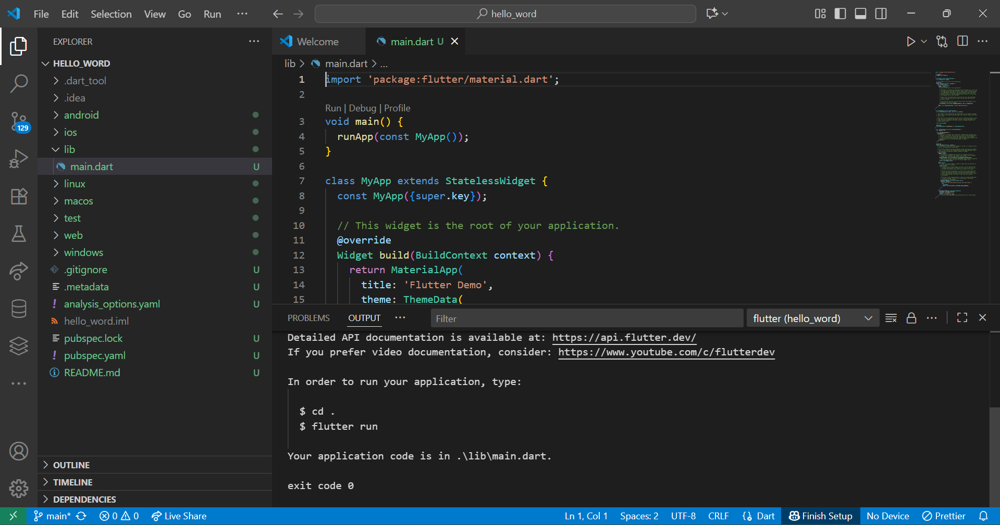
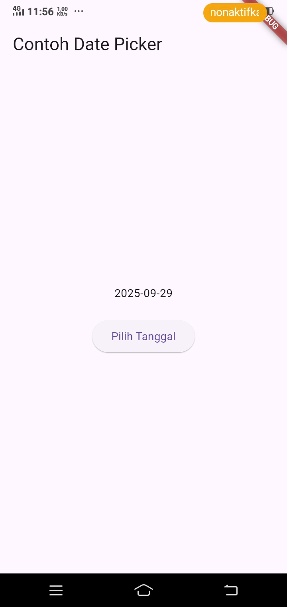
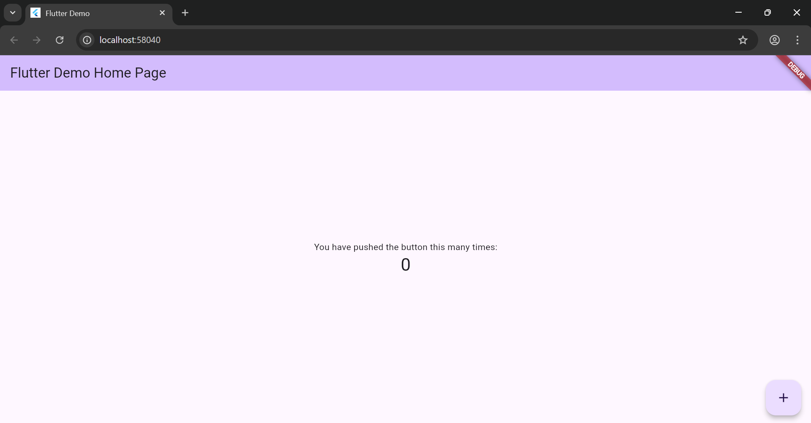
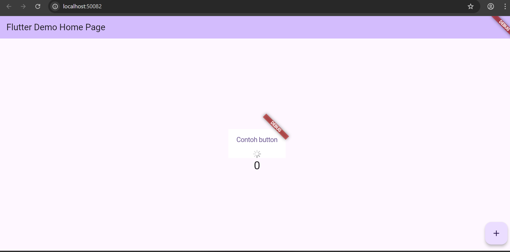
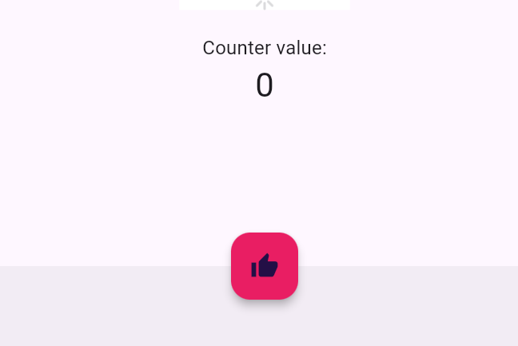
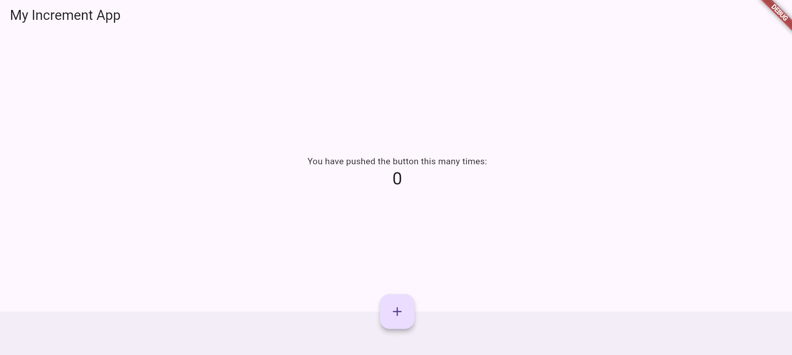
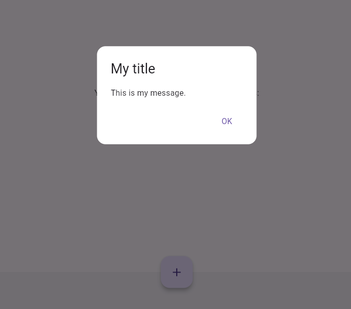
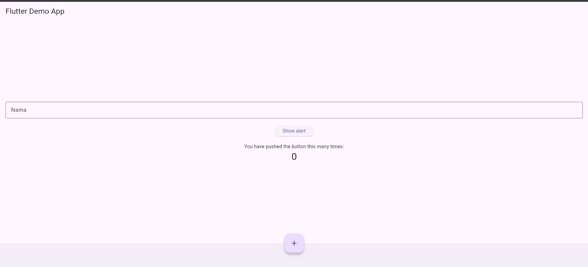

# Pemrograman Mobile - Pertemuan 5

NAMA: Sesy Tana Lina Rahmatin
KELAS: TI-3F
NIM: 2341720029

# Praktikum 1
Hasil akhir:

# Praktikum 2

Berhasil menyambungkan perangkat ke android:

# Praktikum 3
Hasil akhir:

# Praktikum 4
Langkah 1: Text Widget
Hasil Running:

Langkah 2: Image Widget
Hasil Run:

# Praktikum 5: Menerapkan Widget Material Design dan iOS Cupertino

Langkah 1: Cupertino Button dan Loading Bar
Hasil Running:

Langkah 2: Floating Action Button (FAB)
Hasil Running:

Langkah 3: Scaffold Widget
Hasil Running:

Langkah 4: Dialog Widget
Hasil Running:

Langkah 5: Input dan Selection Widget
Hasil Running:

Langkah 6: Date and Time Pickers
Hasil Running:

