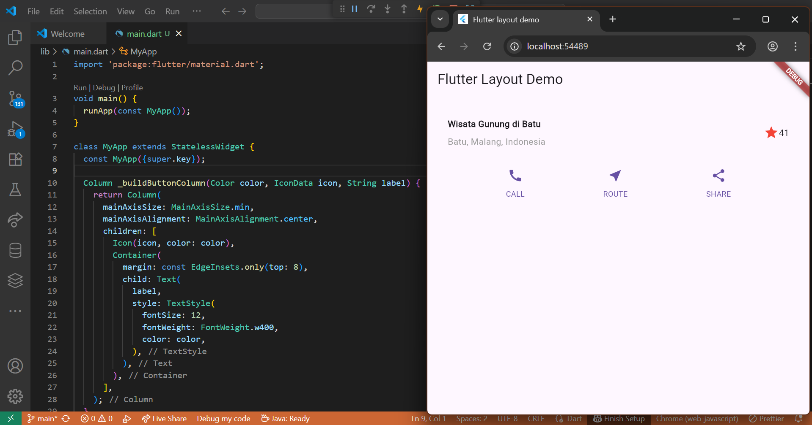

# Pemrograman Mobile - Pertemuan 6

NAMA: Sesy Tana Lina Rahmatin
KELAS: TI-3F
NIM: 2341720029

# Praktikum 1: Membangun Layout di Flutter
Hasil akhir:

# Praktikum 2: Implementasi button row
Hasil akhir:

# Praktikum 3: Implementasi text section
Hasil akhir:

# Praktikum 4: Implementasi image section
Hasil akhir:

# Praktikum 5: Membangun Navigasi di Flutter
Hasil akhir:

