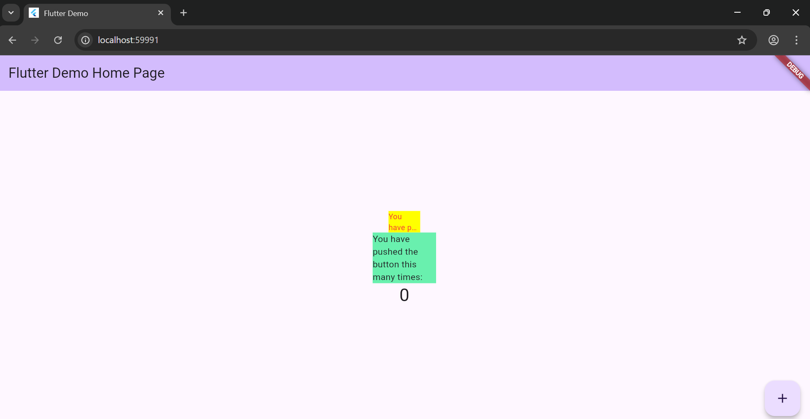

# Pemrograman Mobile - Pertemuan 7

NAMA: Sesy Tana Lina Rahmatin
KELAS: TI-3F
NIM: 2341720029

# Praktikum Menerapkan Plugin di Project Flutter

Hasil run:

# Tugas Praktikum

1. Jelaskan maksud dari langkah 2 pada praktikum tersebut!
   
   Jawab: Langkah 2 bertujuan untuk menambahkan paket auto_size_text ke proyek Flutter agar teks dapat menyesuaikan ukuran font secara otomatis dengan ruang tampilan. Perintah ini juga otomatis menambahkan dependensi ke file pubspec.yaml dan mengunduh paketnya untuk digunakan dalam kode.
2. Jelaskan maksud dari langkah 5 pada praktikum tersebut!
   
   Jawab: Langkah 5 bertujuan untuk menambahkan variabel text agar widget dapat menerima teks dari luar melalui constructor, sehingga nilai teks tersebut bisa ditampilkan di dalam RedTextWidget.
3. Pada langkah 6 terdapat dua widget yang ditambahkan, jelaskan fungsi dan perbedaannya!
   
   Jawab: Pada langkah 6, kedua Container menampilkan teks dengan cara berbeda. Container pertama memakai widget kustom RedTextWidget untuk menampilkan teks berwarna merah, sedangkan Container kedua memakai widget Text biasa tanpa kustomisasi. Perbedaannya, RedTextWidget memiliki gaya khusus, sedangkan Text menampilkan teks standar Flutter.
4. Jelaskan maksud dari tiap parameter yang ada di dalam plugin auto_size_text berdasarkan tautan pada dokumentasi ini !
   
   jawab:
   
 text → teks yang ditampilkan.
   
 style → menentukan warna, ukuran, dan gaya teks.
   
 maxLines → batas maksimal jumlah baris teks.
   
 overflow → cara menangani teks yang tidak muat (misalnya menampilkan “…”).
   
 minFontSize → ukuran font terkecil yang diizinkan.
   
 maxFontSize → ukuran font terbesar yang diizinkan.
   
 textAlign → mengatur perataan teks (kiri, kanan, tengah).
   
 group → menyamakan ukuran teks beberapa widget.
   
 overflowReplacement → widget pengganti jika teks tetap tidak muat.