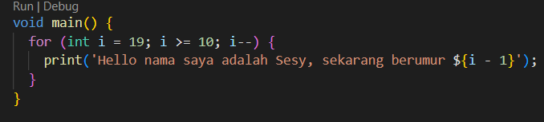
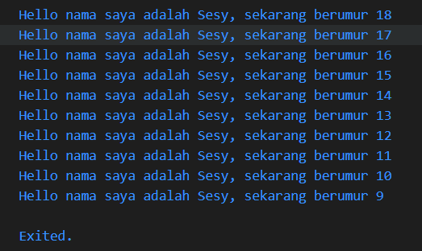

# Pemrograman Mobile - Pertemuan 2

NIM: 2341720029
NAMA: Sesy Tana Lina Rahmatin

**Soal 1**
Modifikasi:


Output:


**Soal 2**
Penting untuk memahami bahasa pemrograman Dart sebelum menggunakan framework Flutter karena:
-Flutter menggunakan bahasa pemrograman Dart, sehingga seluruh logika dan struktur aplikasi dibuat dengan bahasa tersebut.
-Dengan memahami Dart, kita akan lebih mudah mengerti konsep inti Flutter, seperti penggunaan widget, pengelolaan state, serta pemrograman asynchronous.
-Penguasaan Dart juga mendukung proses debugging, meningkatkan performa aplikasi, serta memungkinkan penulisan kode yang lebih aman dan efisien.


 * Codelab #02 – Pengantar Bahasa Pemrograman Dart – Bagian 1
 
Tujuan Utama:
- Menyadari bahwa bahasa Dart adalah fondasi utama dari framework Flutter.
- Memahami asal-usul, evolusi, serta alasan pemilihan Dart sebagai bahasa untuk Flutter.
  :contentReference[oaicite:0]{index=0}

Pokok Bahasan:
1. Memulai dengan Dart
2. Evolusi / Sejarah Dart
3. Cara Kerja Dart
4. Pengenalan Struktur Bahasa Dart
5. Praktik dengan Dart 
   :contentReference[oaicite:1]{index=1}

Persiapan yang Dibutuhkan:
- PC/Laptop minimal RAM 4 GB dan prosesor Core i3
- Koneksi Internet
- Chrome Browser  
  :contentReference[oaicite:2]{index=2}
 
  Prasyarat Pengetahuan:
- Algoritma & Pemrograman Dasar
- Pemrograman Berorientasi Objek (OOP)  
  :contentReference[oaicite:3]{index=3}

Fitur dan Karakteristik Bahasa Dart:
- Productive tooling: tooling analisis kode, plugin IDE, dan ekosistem paket yang luas.
- Garbage collection: manajemen memori otomatis untuk objek yang tak terpakai.
- Type annotations (opsional): mendukung keamanan tipe dan konsistensi data.
- Statically typed dengan type-safe dan type inference**: deteksi bug lebih awal pada saat kompilasi.
- Portability: dapat dikompilasi ke JavaScript untuk web atau ke kode native (ARM/x86).  
  :contentReference[oaicite:4]{index=4}

Pentingnya Menguasai Dart dalam Konteks Flutter:
- Seluruh elemen dalam Flutter, mulai dari kode program, pembuatan plugin, hingga pengaturan dependensi, dikembangkan dengan Dart.
- Memahami dasar-dasar Dart akan mempermudah proses pengembangan Flutter sekaligus meningkatkan efisiensi serta kenyamanan dalam menulis kode.  
 :contentReference[oaicite:5]{index=5}

**Soal 3**
 Kesimpulan:
- Dart bukan hanya bahasa pemrograman, tetapi jantung dari Flutter.
- Dengan menguasai Dart, baik dari sisi fitur, alat bantu, maupun mekanismenya, proses pembuatan aplikasi mobile dapat berjalan lebih cepat dan lebih optimal.

**Soal 4**
Penjelasan perbedaan Null Safety dan Late variabel:
- Null Safety dalam Dart adalah mekanisme yang menjamin sebuah variabel tidak memiliki nilai null kecuali jika memang dideklarasikan untuk itu.
Fitur ini berfungsi untuk mengurangi kemungkinan terjadinya error saat program berjalan akibat penggunaan nilai null pada variabe

Contoh:
```dart
int? angka; angka bisa null
int nilai = 10; Nilai tidak bisa null
```
- Late variabel digunakan untuk menunda inisialisasi variabel non-nullable.
-  Variabel dengan modifier `late` harus diinisialisasi sebelum digunakan, tetapi tidak perlu langsung diinisialisasi saat deklarasi.
 Contoh:
```dart
late String nama;
nama = 'Dart';
print(nama); Output: Dart
 ```