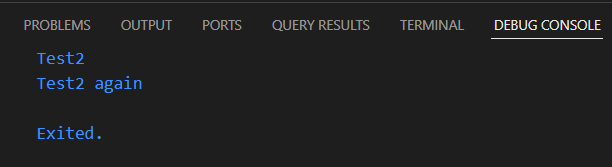
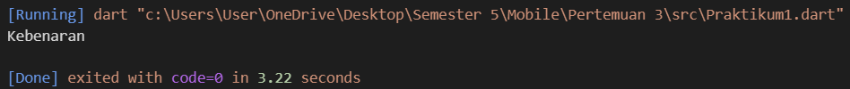
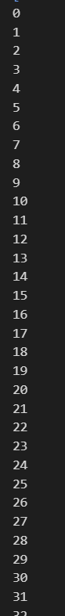
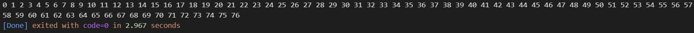
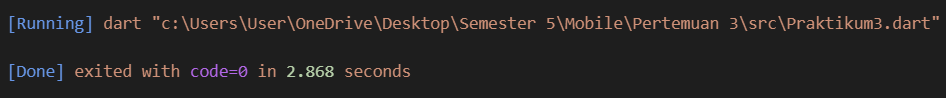
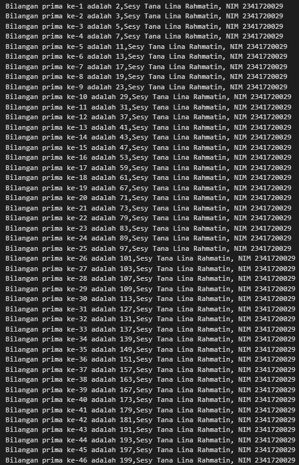

# Pemrograman Mobile - Pertemuan 3

NAMA: Sesy Tana Lina Rahmatin
KELAS: TI-3F
NIM: 2341720029

# Langkah 1
Ketik atau salin kode program berikut ke dalam fungsi main().

String test = "test2";
  if (test == "test1") {
    print("Test1");
  } else if (test == "test2") {
    print("Test2");
  } else {
    print("Something else");
  }

  if (test == "test2") print("Test2 again");

# Langkah 2
Silakan coba eksekusi (Run) kode pada langkah 1 tersebut. Apa yang terjadi? Jelaskan!
= Karena nilai variabel test adalah "test2", maka percabangan else if (test == "test2") dijalankan sehingga menampilkan "Test2". Setelah itu, kondisi if (test == "test2") juga bernilai benar, sehingga perintah di dalamnya dieksekusi dan mencetak "Test2 again".
Output:

# Langkah 3
Tambahkan kode program berikut, lalu coba eksekusi (Run) kode Anda.

bool test1 = true;
  if (test1) {
    print("Kebenaran");
  }

Apa yang terjadi ? Jika terjadi error, silakan perbaiki namun tetap menggunakan if/else.
= Pada saat program melakukan pengecekan terhadap variabel test, muncul error karena nilainya berupa string "true", sedangkan kondisi if hanya bisa mengevaluasi nilai bertipe boolean. Masalah ini bisa diatasi dengan mengubah tipe data variabel menjadi bool, sehingga kondisi dapat dijalankan dengan benar.

Output:

# Praktikum 2: Menerapkan Perulangan "while" dan "do-while"

# Langkah 1
Ketik atau salin kode program berikut ke dalam fungsi main().

while (counter < 33) {
    print(counter);
    counter++;
  }

# Langkah 2
Silakan coba eksekusi (Run) kode pada langkah 1 tersebut. Apa yang terjadi? Jelaskan! Lalu perbaiki jika terjadi error.
= Terjadi perulangan sebanyak 33 kali karena nilai awal counter adalah 0.
Terjadi error karena tidak ada variable counter
Output:

# Langkah 3
Tambahkan kode program berikut, lalu coba eksekusi (Run) kode Anda.

do {
    // print(counter);
    stdout.write("$counter ");
    counter++;
  } while (counter < 77);

Apa yang terjadi ? Jika terjadi error, silakan perbaiki namun tetap menggunakan do-while.
= Pada struktur do-while, perintah dijalankan terlebih dahulu baru kemudian dilakukan pengecekan kondisi.
Hasil keluarannya ditampilkan secara horizontal dengan memanfaatkan stdout.write("$counter ");.
Output:

# Praktikum 3: Menerapkan Perulangan "for" dan "break-continue"

# Langkah 1
Ketik atau salin kode program berikut ke dalam fungsi main().

for (int index = 10; index < 27; index++) {
  print(index);
}

# Langkah 2
Silakan coba eksekusi (Run) kode pada langkah 1 tersebut. Apa yang terjadi? Jelaskan! Lalu perbaiki jika terjadi error.
= Terjadi perulangan for-loop sebanyak 17 kali, pada setiap iterasi, nilai index akan di print. Terjadi error karena penulisan variable index tidak benar
Output:

# Langkah 3
Tambahkan kode program berikut di dalam for-loop, lalu coba eksekusi (Run) kode Anda.

if (index == 21)
  break;
else if (index > 1 || index < 7)
  continue;
print(index);

Apa yang terjadi ? Jika terjadi error, silakan perbaiki namun tetap menggunakan for dan break-continue.
= Pada perulangan for yang berjalan hingga 17 kali, proses akan berhenti lebih awal karena terdapat break saat nilai index mencapai 21. Selain itu, ada juga penggunaan continue, sehingga ketika index bernilai lebih dari 1 atau kurang dari 7, program langsung melompat ke iterasi berikutnya tanpa mengeksekusi perintah setelahnya. Akibatnya, tidak ada keluaran yang ditampilkan.
Kesalahan terjadi karena penulisan variabel index serta logika pada if dan else if tidak dituliskan dengan benar.
Hasil akhirnya memang tidak menampilkan output karena kondisi else if (index > 1 || index < 7) continue;.

Output:

# TUGAS
Buatlah sebuah program yang dapat menampilkan bilangan prima dari angka 0 sampai 201 menggunakan Dart. Ketika bilangan prima ditemukan, maka tampilkan nama lengkap dan NIM Anda.
   
void main() {
  for (int i = 0, count = 0; i <= 201; i++) {
    if (isPrime(i)) {
      count++;
      print(
        'Bilangan prima ke-$count adalah $i,Sesy Tana Lina Rahmatin, NIM 2341720029',
      );
    }
  }
}

bool isPrime(int n) {
  if (n < 2) return false;
  if (n % 2 == 0) return n == 2;
  for (int i = 3; i * i <= n; i += 2) {
    if (n % i == 0) return false;
  }
  return true;
}

Output:
